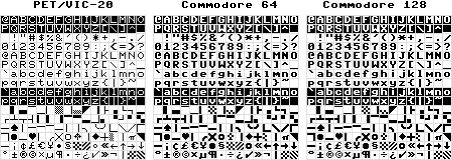

# PETSCII-8

PETSCII-8 is an 8-bit encoding with the goal of
being compatible with both ASCII and PETSCII.

## Mapping from PETSCII to PETSCII-8

Mapping from PETSCII to PETSCII-8 is reasonably simple.
Start with the following substitutions:

* Map `60` — `7F` to `C0` — `DF` (ADD `60` or XOR `A0`)
* Map `E0` — `FE` to `A0` — `BE` (SUB `40` or XOR `40`)
* Map `FF` to `DE`
* Map `5C` to `E3`
* Map `5E` to `ED`
* Map `5F` to `EC`

If in uppercase mode, we are done; no additional substitutions
need to be made.

If in lowercase mode, the following additional substitutions
need to be made following and on top of the previous ones:

* Map `41` — `5A` to `61` — `7A` (ADD `20` or XOR `20`)
* Map `C1` — `DA` to `41` — `5A` (SUB `80` or XOR `80`)
* Map `A9` to `E9`
* Map `BA` to `FA`
* Map `DE` to either `E8` (for compatibility with the PET or
  VIC-20) or `FE` (for compatibility with the C64 or C128)
* Map `DF` to `FF`

## Mapping from PETSCII-8 to Unicode

A mapping table in Format A is included in
[MAPPINGS/PETSCII8.TXT](MAPPINGS/PETSCII8.TXT).

`00` — `A0` map directly to `U+0000` — `U+00A0`.
The mapping for `A0` — `DF` follows below.
The mapping for `E0` — `FF` is given in the Rationale section.

| PETSCII-8 | Unicode |
|-----------|---------|
| `A0` | `U+00A0  NO-BREAK SPACE`
| `A1` | `U+258C  LEFT HALF BLOCK`
| `A2` | `U+2584  LOWER HALF BLOCK`
| `A3` | `U+2594  UPPER ONE EIGHTH BLOCK`
| `A4` | `U+2581  LOWER ONE EIGHTH BLOCK`
| `A5` | `U+258F  LEFT ONE EIGHTH BLOCK`
| `A6` | `U+2592  MEDIUM SHADE`
| `A7` | `U+2595  RIGHT ONE EIGHTH BLOCK`
| `A8` | `U+1FB8F LOWER HALF MEDIUM SHADE`
| `A9` | `U+25E4  BLACK UPPER LEFT TRIANGLE`
| `AA` | `U+1FB87 RIGHT ONE QUARTER BLOCK`
| `AB` | `U+251C  BOX DRAWINGS LIGHT VERTICAL AND RIGHT`
| `AC` | `U+2597  QUADRANT LOWER RIGHT`
| `AD` | `U+2514  BOX DRAWINGS LIGHT UP AND RIGHT`
| `AE` | `U+2510  BOX DRAWINGS LIGHT DOWN AND LEFT`
| `AF` | `U+2582  LOWER ONE QUARTER BLOCK`
| `B0` | `U+250C  BOX DRAWINGS LIGHT DOWN AND RIGHT`
| `B1` | `U+2534  BOX DRAWINGS LIGHT UP AND HORIZONTAL`
| `B2` | `U+252C  BOX DRAWINGS LIGHT DOWN AND HORIZONTAL`
| `B3` | `U+2524  BOX DRAWINGS LIGHT VERTICAL AND LEFT`
| `B4` | `U+258E  LEFT ONE QUARTER BLOCK`
| `B5` | `U+258D  LEFT THREE EIGHTHS BLOCK`
| `B6` | `U+1FB88 RIGHT THREE EIGHTHS BLOCK`
| `B7` | `U+1FB82 UPPER ONE QUARTER BLOCK`
| `B8` | `U+1FB83 UPPER THREE EIGHTHS BLOCK`
| `B9` | `U+2583  LOWER THREE EIGHTHS BLOCK`
| `BA` | `U+1FB7F RIGHT AND LOWER ONE EIGHTH BLOCK`
| `BB` | `U+2596  QUADRANT LOWER LEFT`
| `BC` | `U+259D  QUADRANT UPPER RIGHT`
| `BD` | `U+2518  BOX DRAWINGS LIGHT UP AND LEFT`
| `BE` | `U+2598  QUADRANT UPPER LEFT`
| `BF` | `U+259A  QUADRANT UPPER LEFT AND LOWER RIGHT`
| `C0` | `U+2500  BOX DRAWINGS LIGHT HORIZONTAL`
| `C1` | `U+2660  BLACK SPADE SUIT`
| `C2` | `U+1FB72 VERTICAL ONE EIGHTH BLOCK-4`
| `C3` | `U+1FB78 HORIZONTAL ONE EIGHTH BLOCK-4`
| `C4` | `U+1FB77 HORIZONTAL ONE EIGHTH BLOCK-3`
| `C5` | `U+1FB76 HORIZONTAL ONE EIGHTH BLOCK-2`
| `C6` | `U+1FB7A HORIZONTAL ONE EIGHTH BLOCK-6`
| `C7` | `U+1FB71 VERTICAL ONE EIGHTH BLOCK-3`
| `C8` | `U+1FB74 VERTICAL ONE EIGHTH BLOCK-6`
| `C9` | `U+256E  BOX DRAWINGS LIGHT ARC DOWN AND LEFT`
| `CA` | `U+2570  BOX DRAWINGS LIGHT ARC UP AND RIGHT`
| `CB` | `U+256F  BOX DRAWINGS LIGHT ARC UP AND LEFT`
| `CC` | `U+1FB7C LEFT AND LOWER ONE EIGHTH BLOCK`
| `CD` | `U+2572  BOX DRAWINGS LIGHT DIAGONAL UPPER LEFT TO LOWER RIGHT`
| `CE` | `U+2571  BOX DRAWINGS LIGHT DIAGONAL UPPER RIGHT TO LOWER LEFT`
| `CF` | `U+1FB7D LEFT AND UPPER ONE EIGHTH BLOCK`
| `D0` | `U+1FB7E RIGHT AND UPPER ONE EIGHTH BLOCK`
| `D1` | `U+25CF  BLACK CIRCLE`
| `D2` | `U+1FB7B HORIZONTAL ONE EIGHTH BLOCK-7`
| `D3` | `U+2665  BLACK HEART SUIT`
| `D4` | `U+1FB70 VERTICAL ONE EIGHTH BLOCK-2`
| `D5` | `U+256D  BOX DRAWINGS LIGHT ARC DOWN AND RIGHT`
| `D6` | `U+2573  BOX DRAWINGS LIGHT DIAGONAL CROSS`
| `D7` | `U+25CB  WHITE CIRCLE`
| `D8` | `U+2663  BLACK CLUB SUIT`
| `D9` | `U+1FB75 VERTICAL ONE EIGHTH BLOCK-7`
| `DA` | `U+2666  BLACK DIAMOND SUIT`
| `DB` | `U+253C  BOX DRAWINGS LIGHT VERTICAL AND HORIZONTAL`
| `DC` | `U+1FB8C LEFT HALF MEDIUM SHADE`
| `DD` | `U+2502  BOX DRAWINGS LIGHT VERTICAL`
| `DE` | `U+03C0  GREEK SMALL LETTER PI`
| `DF` | `U+25E5  BLACK UPPER RIGHT TRIANGLE`

## Rationale

Each and every character and its placement in
PETSCII-8 is chosen carefully and deliberately:

* Characters 00-7F are identical to ASCII.

* Characters 00-5F and 80-DF are identical to PETSCII
with the exception of the characters £ ↑ ←, which
have been relocated for sake of ASCII compatibility.

* Characters E0-FF include PETSCII characters which
map to multiple Unicode characters (for round-trip
compatibility), characters from the lowercase mode
of PETSCII, and a selection of characters from
the Teletext G2 character set and ISO Latin-9:

| PETSCII-8 | Unicode | Rationale |
|-----------|---------|-----------|
| `E0` | `U+1FB79 HORIZONTAL ONE EIGHTH BLOCK-5`              | `C0` in PETSCII. Also mappable to `U+2500 BOX DRAWINGS LIGHT HORIZONTAL`, but we use `C0` for the version mapped to that character.
| `E1` | `U+00A1  INVERTED EXCLAMATION MARK`                  | `A1` in Teletext G2 and ISO Latin-9, hence the encoding at `E1`.
| `E2` | `U+00A2  CENT SIGN`                                  | `A2` in Teletext G2 and ISO Latin-9, hence the encoding at `E2`.
| `E3` | `U+00A3  POUND SIGN`                                 | `5C` in PETSCII, but relocated for sake of ASCII compatibility. `A3` in Teletext G2 and ISO Latin-9, hence the encoding at `E3`.
| `E4` | `U+20AC  EURO SIGN`                                  | `A4` in ISO Latin-9, hence the encoding at `E4`.
| `E5` | `U+00A5  YEN SIGN`                                   | `A5` in Teletext G2 and ISO Latin-9, hence the encoding at `E5`.
| `E6` | `U+2022  BULLET`                                     | `D1` in PETSCII. Also mappable to `U+25CF BLACK CIRCLE`, but we use `D1` for the version mapped to that character.
| `E7` | `U+00A7  SECTION SIGN`                               | `A7` in Teletext G2 and ISO Latin-9, hence the encoding at `E7`.
| `E8` | `U+1FB95 CHECKER BOARD FILL`                         | `DE` in PETSCII lowercase mode on the Commodore PET and VIC-20. Can't be `FE` in PETSCII-8 due to collision with `INVERSE CHECKER BOARD FILL`.
| `E9` | `U+1FB99 UPPER RIGHT TO LOWER LEFT FILL`             | `A9` in PETSCII lowercase mode.
| `EA` | `U+25E6  WHITE BULLET`                               | `D7` in PETSCII. Also mappable to `U+25CB WHITE CIRCLE`, but we use `D7` for the version mapped to that character.
| `EB` | `U+00AB  LEFT-POINTING DOUBLE ANGLE QUOTATION MARK`  | `AB` in Teletext G2 and ISO Latin-9, hence the encoding at `EB`.
| `EC` | `U+2190  LEFTWARDS ARROW`                            | `5F` in PETSCII, but relocated for sake of ASCII compatibility. `AC` in Teletext G2, hence the encoding at `EC`.
| `ED` | `U+2191  UPWARDS ARROW`                              | `5E` in PETSCII, but relocated for sake of ASCII compatibility. `AD` in Teletext G2, hence the encoding at `ED`.
| `EE` | `U+2192  RIGHTWARDS ARROW`                           | `AE` in Teletext G2, hence the encoding at `EE`.
| `EF` | `U+2193  DOWNWARDS ARROW`                            | `AF` in Teletext G2, hence the encoding at `EF`.
| `F0` | `U+00B0  DEGREE SIGN`                                | `B0` in Teletext G2 and ISO Latin-9, hence the encoding at `F0`.
| `F1` | `U+00B1  PLUS-MINUS SIGN`                            | `B1` in Teletext G2 and ISO Latin-9, hence the encoding at `F1`.
| `F2` | `U+00AE  REGISTERED SIGN`                            | `D2` in Teletext G2, hence the encoding at `F2`. Also `AE` in ISO Latin-9, but can't be `EE` in PETSCII-8 due to collision with `RIGHTWARDS ARROW`.
| `F3` | `U+00A9  COPYRIGHT SIGN`                             | `D3` in Teletext G2, hence the encoding at `F3`. Also `A9` in ISO Latin-9, but can't be `E9` in PETSCII-8 due to collision with `UPPER RIGHT TO LOWER LEFT FILL`.
| `F4` | `U+00D7  MULTIPLICATION SIGN`                        | `B4` in Teletext G2, hence the encoding at `F4`. Also `D7` in ISO Latin-9, but can't be `F7` in PETSCII-8 due to collision with `MIDDLE DOT`.
| `F5` | `U+00B5  MICRO SIGN`                                 | `B5` in Teletext G2 and ISO Latin-9, hence the encoding at `F5`.
| `F6` | `U+00B6  PILCROW SIGN`                               | `B6` in Teletext G2 and ISO Latin-9, hence the encoding at `F6`.
| `F7` | `U+00B7  MIDDLE DOT`                                 | `B7` in Teletext G2 and ISO Latin-9, hence the encoding at `F7`.
| `F8` | `U+00F7  DIVISION SIGN`                              | `B8` in Teletext G2, hence the encoding at `F8`. Also `F7` in ISO Latin-9, but can't be `F7` in PETSCII-8 due to collision with `MIDDLE DOT`.
| `F9` | `U+00BF  INVERTED QUESTION MARK`                     | `BF` in Teletext G2 and ISO Latin-9, but can't be `FF` in PETSCII-8 due to collision with `UPPER LEFT TO LOWER RIGHT FILL`.
| `FA` | `U+2713  CHECK MARK`                                 | `BA` in PETSCII lowercase mode.
| `FB` | `U+00BB  RIGHT-POINTING DOUBLE ANGLE QUOTATION MARK` | `BB` in Teletext G2 and ISO Latin-9, hence the encoding at `FB`.
| `FC` | `U+00AC  NOT SIGN`                                   | `AC` in ISO Latin-9, but can't be `EC` in PETSCII-8 due to collision with `LEFTWARDS ARROW`.
| `FD` | `U+1FB73 VERTICAL ONE EIGHTH BLOCK-5`                | `DD` in PETSCII. Also mappable to `U+2502 BOX DRAWINGS LIGHT VERTICAL`, but we use `DD` for the version mapped to that character.
| `FE` | `U+1FB96 INVERSE CHECKER BOARD FILL`                 | `DE` in PETSCII lowercase mode on the Commodore 64 and 128.
| `FF` | `U+1FB98 UPPER LEFT TO LOWER RIGHT FILL`             | `DF` in PETSCII lowercase mode.

The only non-alphabetic characters in ISO Latin-9
not in PETSCII-8 are ¹ ² ³ ª º ¯ and soft hyphen.
Similarly, the only non-alphabetic characters in
Teletext G2 not in PETSCII-8 are ¹ ² ³ ‘ ’ “ ” ¤
™ ♪ ₠ ‰ α ¼ ½ ¾ ⅛ ⅜ ⅝ ⅞ ª º and diacritical marks.
You can see that we're not missing much.
