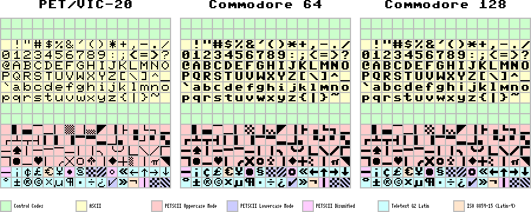
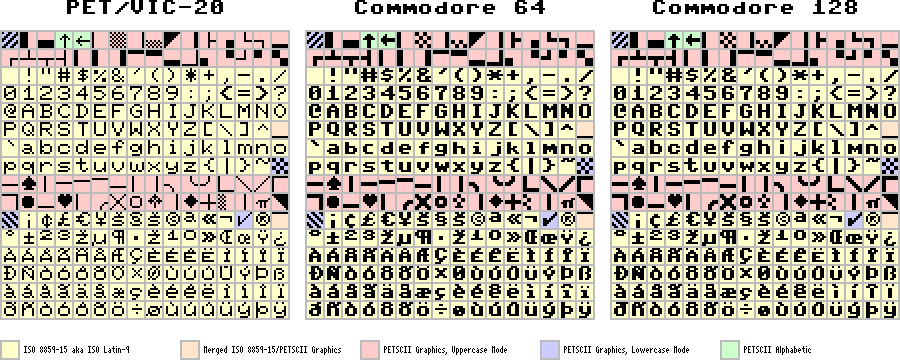

# PETSCII-8 and Latin-9P

PETSCII-8 is an 8-bit encoding with the goal of
being compatible with both ASCII and PETSCII.

Latin-9P is an 8-bit encoding with the goal of being compatible
with both ISO 8859-15 (aka ISO Latin-9) and PETSCII.
(In order to do this, however, control characters must be removed.
Thus, this is only viable as an underlying video RAM encoding.)

## Mapping from PETSCII to PETSCII-8

Mapping from PETSCII to PETSCII-8 is reasonably simple.
Start with the following substitutions:

* Map `60` — `7F` to `C0` — `DF` (ADD `60` or XOR `A0`)
* Map `E0` — `FE` to `A0` — `BE` (SUB `40` or XOR `40`)
* Map `FF` to `DE`
* Map `5C` to `E3`
* Map `5E` to `ED`
* Map `5F` to `EC`

If in uppercase mode, we are done; no additional substitutions
need to be made.

If in lowercase mode, the following additional substitutions
need to be made following and on top of the previous ones:

* Map `41` — `5A` to `61` — `7A` (ADD `20` or XOR `20`)
* Map `C1` — `DA` to `41` — `5A` (SUB `80` or XOR `80`)
* Map `A9` to `E9`
* Map `BA` to `FA`
* Map `DE` to either `E8` (for compatibility with the PET or
  VIC-20) or `FE` (for compatibility with the C64 or C128)
* Map `DF` to `FF`

Source code to perform these conversions and more
is available in [src/petscii8.s](src/petscii8.s).

## Mapping from PETSCII to Latin-9P

Mapping from PETSCII to Latin-9P is a bit more involved.
Start with the following substitutions:

* Map `5E` to `03`
* Map `5F` to `04`
* Map `60` — `7F` to `80` — `9F` (ADD `20` or XOR `E0`)
* Map `A1` — `A2` to `01` — `02` (SUB `A0` or XOR `A0`)
* Map `A5` — `BF` to `05` — `1F` (SUB `A0` or XOR `A0`)
* Map `C0` — `DF` to `80` — `9F` (SUB `40` or XOR `40`)
* Map `E1` — `E2` to `01` — `02` (SUB `E0` or XOR `E0`)
* Map `E5` — `FE` to `05` — `1E` (SUB `E0` or XOR `E0`)
* Map `FF` to `9E`
* Map `A0` and `E0` to `20`
* Map `A3` and `E3` to `AF`
* Map `A4` and `E4` to `5F`
* Map `5C` to `A3`

If in uppercase mode, we are done; no additional substitutions
need to be made.

If in lowercase mode, the following additional substitutions
need to be made following and on top of the previous ones:

* Map `41` — `5A` to `61` — `7A` (ADD `20` or XOR `20`)
* Map `81` — `9A` to `41` — `5A` (SUB `40` or XOR `C0`)
* Map `09` to `00`
* Map `1A` to `AD`
* Map `9E` to `7F`
* Map `9F` to `A0`

## Mapping from ISO 8859-15 to Latin-9P

This is trivial. The only substitutions to be made are:

* Map `A0` to `20`
* Map `AD` to `2D`

## Mapping from PETSCII-8 to Unicode

A mapping table in Format A is included in
[MAPPINGS/PETSCII8.TXT](MAPPINGS/PETSCII8.TXT).

`00` — `A0` map directly to `U+0000` — `U+00A0`.
The mapping for `A0` — `DF` follows below.
The mapping for `E0` — `FF` is given in the
PETSCII-8 Character Selection Rationale section.

| PETSCII-8 | Unicode |
|-----------|---------|
| `A0` | `U+00A0  NO-BREAK SPACE`
| `A1` | `U+258C  LEFT HALF BLOCK`
| `A2` | `U+2584  LOWER HALF BLOCK`
| `A3` | `U+2594  UPPER ONE EIGHTH BLOCK`
| `A4` | `U+2581  LOWER ONE EIGHTH BLOCK`
| `A5` | `U+258F  LEFT ONE EIGHTH BLOCK`
| `A6` | `U+2592  MEDIUM SHADE`
| `A7` | `U+2595  RIGHT ONE EIGHTH BLOCK`
| `A8` | `U+1FB8F LOWER HALF MEDIUM SHADE`
| `A9` | `U+25E4  BLACK UPPER LEFT TRIANGLE`
| `AA` | `U+1FB87 RIGHT ONE QUARTER BLOCK`
| `AB` | `U+251C  BOX DRAWINGS LIGHT VERTICAL AND RIGHT`
| `AC` | `U+2597  QUADRANT LOWER RIGHT`
| `AD` | `U+2514  BOX DRAWINGS LIGHT UP AND RIGHT`
| `AE` | `U+2510  BOX DRAWINGS LIGHT DOWN AND LEFT`
| `AF` | `U+2582  LOWER ONE QUARTER BLOCK`
| `B0` | `U+250C  BOX DRAWINGS LIGHT DOWN AND RIGHT`
| `B1` | `U+2534  BOX DRAWINGS LIGHT UP AND HORIZONTAL`
| `B2` | `U+252C  BOX DRAWINGS LIGHT DOWN AND HORIZONTAL`
| `B3` | `U+2524  BOX DRAWINGS LIGHT VERTICAL AND LEFT`
| `B4` | `U+258E  LEFT ONE QUARTER BLOCK`
| `B5` | `U+258D  LEFT THREE EIGHTHS BLOCK`
| `B6` | `U+1FB88 RIGHT THREE EIGHTHS BLOCK`
| `B7` | `U+1FB82 UPPER ONE QUARTER BLOCK`
| `B8` | `U+1FB83 UPPER THREE EIGHTHS BLOCK`
| `B9` | `U+2583  LOWER THREE EIGHTHS BLOCK`
| `BA` | `U+1FB7F RIGHT AND LOWER ONE EIGHTH BLOCK`
| `BB` | `U+2596  QUADRANT LOWER LEFT`
| `BC` | `U+259D  QUADRANT UPPER RIGHT`
| `BD` | `U+2518  BOX DRAWINGS LIGHT UP AND LEFT`
| `BE` | `U+2598  QUADRANT UPPER LEFT`
| `BF` | `U+259A  QUADRANT UPPER LEFT AND LOWER RIGHT`
| `C0` | `U+2500  BOX DRAWINGS LIGHT HORIZONTAL`
| `C1` | `U+2660  BLACK SPADE SUIT`
| `C2` | `U+1FB72 VERTICAL ONE EIGHTH BLOCK-4`
| `C3` | `U+1FB78 HORIZONTAL ONE EIGHTH BLOCK-4`
| `C4` | `U+1FB77 HORIZONTAL ONE EIGHTH BLOCK-3`
| `C5` | `U+1FB76 HORIZONTAL ONE EIGHTH BLOCK-2`
| `C6` | `U+1FB7A HORIZONTAL ONE EIGHTH BLOCK-6`
| `C7` | `U+1FB71 VERTICAL ONE EIGHTH BLOCK-3`
| `C8` | `U+1FB74 VERTICAL ONE EIGHTH BLOCK-6`
| `C9` | `U+256E  BOX DRAWINGS LIGHT ARC DOWN AND LEFT`
| `CA` | `U+2570  BOX DRAWINGS LIGHT ARC UP AND RIGHT`
| `CB` | `U+256F  BOX DRAWINGS LIGHT ARC UP AND LEFT`
| `CC` | `U+1FB7C LEFT AND LOWER ONE EIGHTH BLOCK`
| `CD` | `U+2572  BOX DRAWINGS LIGHT DIAGONAL UPPER LEFT TO LOWER RIGHT`
| `CE` | `U+2571  BOX DRAWINGS LIGHT DIAGONAL UPPER RIGHT TO LOWER LEFT`
| `CF` | `U+1FB7D LEFT AND UPPER ONE EIGHTH BLOCK`
| `D0` | `U+1FB7E RIGHT AND UPPER ONE EIGHTH BLOCK`
| `D1` | `U+25CF  BLACK CIRCLE`
| `D2` | `U+1FB7B HORIZONTAL ONE EIGHTH BLOCK-7`
| `D3` | `U+2665  BLACK HEART SUIT`
| `D4` | `U+1FB70 VERTICAL ONE EIGHTH BLOCK-2`
| `D5` | `U+256D  BOX DRAWINGS LIGHT ARC DOWN AND RIGHT`
| `D6` | `U+2573  BOX DRAWINGS LIGHT DIAGONAL CROSS`
| `D7` | `U+25CB  WHITE CIRCLE`
| `D8` | `U+2663  BLACK CLUB SUIT`
| `D9` | `U+1FB75 VERTICAL ONE EIGHTH BLOCK-7`
| `DA` | `U+2666  BLACK DIAMOND SUIT`
| `DB` | `U+253C  BOX DRAWINGS LIGHT VERTICAL AND HORIZONTAL`
| `DC` | `U+1FB8C LEFT HALF MEDIUM SHADE`
| `DD` | `U+2502  BOX DRAWINGS LIGHT VERTICAL`
| `DE` | `U+03C0  GREEK SMALL LETTER PI`
| `DF` | `U+25E5  BLACK UPPER RIGHT TRIANGLE`

## PETSCII-8 Character Selection Rationale

Each and every character and its placement in
PETSCII-8 is chosen carefully and deliberately:

* Characters 00-7F are identical to ASCII.

* Characters 00-5F and 80-DF are identical to PETSCII
with the exception of the characters £ ↑ ←, which
have been relocated for sake of ASCII compatibility.

* Characters E0-FF include PETSCII characters which
map to multiple Unicode characters (for round-trip
compatibility), characters from the lowercase mode
of PETSCII, and a selection of characters from
the Teletext G2 character set and ISO Latin-9:

| PETSCII-8 | Unicode | Rationale |
|-----------|---------|-----------|
| `E0` | `U+1FB79 HORIZONTAL ONE EIGHTH BLOCK-5`              | `C0` in PETSCII. Also mappable to `U+2500 BOX DRAWINGS LIGHT HORIZONTAL`, but we use `C0` for the version mapped to that character.
| `E1` | `U+00A1  INVERTED EXCLAMATION MARK`                  | `A1` in Teletext G2 and ISO Latin-9, hence the encoding at `E1`.
| `E2` | `U+00A2  CENT SIGN`                                  | `A2` in Teletext G2 and ISO Latin-9, hence the encoding at `E2`.
| `E3` | `U+00A3  POUND SIGN`                                 | `5C` in PETSCII, but relocated for sake of ASCII compatibility. `A3` in Teletext G2 and ISO Latin-9, hence the encoding at `E3`.
| `E4` | `U+20AC  EURO SIGN`                                  | `A4` in ISO Latin-9, hence the encoding at `E4`.
| `E5` | `U+00A5  YEN SIGN`                                   | `A5` in Teletext G2 and ISO Latin-9, hence the encoding at `E5`.
| `E6` | `U+2022  BULLET`                                     | `D1` in PETSCII. Also mappable to `U+25CF BLACK CIRCLE`, but we use `D1` for the version mapped to that character.
| `E7` | `U+00A7  SECTION SIGN`                               | `A7` in Teletext G2 and ISO Latin-9, hence the encoding at `E7`.
| `E8` | `U+1FB95 CHECKER BOARD FILL`                         | `DE` in PETSCII lowercase mode on the Commodore PET and VIC-20. Can't be `FE` in PETSCII-8 due to collision with `INVERSE CHECKER BOARD FILL`.
| `E9` | `U+1FB99 UPPER RIGHT TO LOWER LEFT FILL`             | `A9` in PETSCII lowercase mode.
| `EA` | `U+25E6  WHITE BULLET`                               | `D7` in PETSCII. Also mappable to `U+25CB WHITE CIRCLE`, but we use `D7` for the version mapped to that character.
| `EB` | `U+00AB  LEFT-POINTING DOUBLE ANGLE QUOTATION MARK`  | `AB` in Teletext G2 and ISO Latin-9, hence the encoding at `EB`.
| `EC` | `U+2190  LEFTWARDS ARROW`                            | `5F` in PETSCII, but relocated for sake of ASCII compatibility. `AC` in Teletext G2, hence the encoding at `EC`.
| `ED` | `U+2191  UPWARDS ARROW`                              | `5E` in PETSCII, but relocated for sake of ASCII compatibility. `AD` in Teletext G2, hence the encoding at `ED`.
| `EE` | `U+2192  RIGHTWARDS ARROW`                           | `AE` in Teletext G2, hence the encoding at `EE`.
| `EF` | `U+2193  DOWNWARDS ARROW`                            | `AF` in Teletext G2, hence the encoding at `EF`.
| `F0` | `U+00B0  DEGREE SIGN`                                | `B0` in Teletext G2 and ISO Latin-9, hence the encoding at `F0`.
| `F1` | `U+00B1  PLUS-MINUS SIGN`                            | `B1` in Teletext G2 and ISO Latin-9, hence the encoding at `F1`.
| `F2` | `U+00AE  REGISTERED SIGN`                            | `D2` in Teletext G2, hence the encoding at `F2`. Also `AE` in ISO Latin-9, but can't be `EE` in PETSCII-8 due to collision with `RIGHTWARDS ARROW`.
| `F3` | `U+00A9  COPYRIGHT SIGN`                             | `D3` in Teletext G2, hence the encoding at `F3`. Also `A9` in ISO Latin-9, but can't be `E9` in PETSCII-8 due to collision with `UPPER RIGHT TO LOWER LEFT FILL`.
| `F4` | `U+00D7  MULTIPLICATION SIGN`                        | `B4` in Teletext G2, hence the encoding at `F4`. Also `D7` in ISO Latin-9, but can't be `F7` in PETSCII-8 due to collision with `MIDDLE DOT`.
| `F5` | `U+00B5  MICRO SIGN`                                 | `B5` in Teletext G2 and ISO Latin-9, hence the encoding at `F5`.
| `F6` | `U+00B6  PILCROW SIGN`                               | `B6` in Teletext G2 and ISO Latin-9, hence the encoding at `F6`.
| `F7` | `U+00B7  MIDDLE DOT`                                 | `B7` in Teletext G2 and ISO Latin-9, hence the encoding at `F7`.
| `F8` | `U+00F7  DIVISION SIGN`                              | `B8` in Teletext G2, hence the encoding at `F8`. Also `F7` in ISO Latin-9, but can't be `F7` in PETSCII-8 due to collision with `MIDDLE DOT`.
| `F9` | `U+00BF  INVERTED QUESTION MARK`                     | `BF` in Teletext G2 and ISO Latin-9, but can't be `FF` in PETSCII-8 due to collision with `UPPER LEFT TO LOWER RIGHT FILL`.
| `FA` | `U+2713  CHECK MARK`                                 | `BA` in PETSCII lowercase mode.
| `FB` | `U+00BB  RIGHT-POINTING DOUBLE ANGLE QUOTATION MARK` | `BB` in Teletext G2 and ISO Latin-9, hence the encoding at `FB`.
| `FC` | `U+00AC  NOT SIGN`                                   | `AC` in ISO Latin-9, but can't be `EC` in PETSCII-8 due to collision with `LEFTWARDS ARROW`.
| `FD` | `U+1FB73 VERTICAL ONE EIGHTH BLOCK-5`                | `DD` in PETSCII. Also mappable to `U+2502 BOX DRAWINGS LIGHT VERTICAL`, but we use `DD` for the version mapped to that character.
| `FE` | `U+1FB96 INVERSE CHECKER BOARD FILL`                 | `DE` in PETSCII lowercase mode on the Commodore 64 and 128.
| `FF` | `U+1FB98 UPPER LEFT TO LOWER RIGHT FILL`             | `DF` in PETSCII lowercase mode.

The only non-alphabetic characters in ISO Latin-9
not in PETSCII-8 are ¹ ² ³ ª º ¯ and soft hyphen.
Similarly, the only non-alphabetic characters in
Teletext G2 not in PETSCII-8 are ¹ ² ³ ‘ ’ “ ” ¤
™ ♪ ₠ ‰ α ¼ ½ ¾ ⅛ ⅜ ⅝ ⅞ ª º and diacritical marks.
You can see that we're not missing much.

## Mapping from Latin-9P to Unicode

A mapping table in Format A is included in
[MAPPINGS/LATIN9P.TXT](MAPPINGS/LATIN9P.TXT).

Some characters which have been unified in Latin-9P
map to multiple Unicode characters as a result.

| Latin-9P | Unicode |
|----------|---------|
| `00` | `U+1FB99 UPPER RIGHT TO LOWER LEFT FILL`
| `01` | `U+258C LEFT HALF BLOCK`
| `02` | `U+2584 LOWER HALF BLOCK`
| `03` | `U+2191 UPWARDS ARROW`
| `04` | `U+2190 LEFTWARDS ARROW`
| `05` | `U+258F LEFT ONE EIGHTH BLOCK`
| `06` | `U+2592 MEDIUM SHADE`
| `07` | `U+2595 RIGHT ONE EIGHTH BLOCK`
| `08` | `U+1FB8F LOWER HALF MEDIUM SHADE`
| `09` | `U+25E4 BLACK UPPER LEFT TRIANGLE`
| `0A` | `U+1FB87 RIGHT ONE QUARTER BLOCK`
| `0B` | `U+251C BOX DRAWINGS LIGHT VERTICAL AND RIGHT`
| `0C` | `U+2597 QUADRANT LOWER RIGHT`
| `0D` | `U+2514 BOX DRAWINGS LIGHT UP AND RIGHT`
| `0E` | `U+2510 BOX DRAWINGS LIGHT DOWN AND LEFT`
| `0F` | `U+2582 LOWER ONE QUARTER BLOCK`
| `10` | `U+250C BOX DRAWINGS LIGHT DOWN AND RIGHT`
| `11` | `U+2534 BOX DRAWINGS LIGHT UP AND HORIZONTAL`
| `12` | `U+252C BOX DRAWINGS LIGHT DOWN AND HORIZONTAL`
| `13` | `U+2524 BOX DRAWINGS LIGHT VERTICAL AND LEFT`
| `14` | `U+258E LEFT ONE QUARTER BLOCK`
| `15` | `U+258D LEFT THREE EIGHTHS BLOCK`
| `16` | `U+1FB88 RIGHT THREE EIGHTHS BLOCK`
| `17` | `U+1FB82 UPPER ONE QUARTER BLOCK`
| `18` | `U+1FB83 UPPER THREE EIGHTHS BLOCK`
| `19` | `U+2583 LOWER THREE EIGHTHS BLOCK`
| `1A` | `U+1FB7F RIGHT AND LOWER ONE EIGHTH BLOCK`
| `1B` | `U+2596 QUADRANT LOWER LEFT`
| `1C` | `U+259D QUADRANT UPPER RIGHT`
| `1D` | `U+2518 BOX DRAWINGS LIGHT UP AND LEFT`
| `1E` | `U+2598 QUADRANT UPPER LEFT`
| `1F` | `U+259A QUADRANT UPPER LEFT AND LOWER RIGHT`
| `20` | `U+0020 SPACE`, `U+00A0 NO-BREAK SPACE`
| `21` | `U+0021 EXCLAMATION MARK`
| `22` | `U+0022 QUOTATION MARK`
| `23` | `U+0023 NUMBER SIGN`
| `24` | `U+0024 DOLLAR SIGN`
| `25` | `U+0025 PERCENT SIGN`
| `26` | `U+0026 AMPERSAND`
| `27` | `U+0027 APOSTROPHE`
| `28` | `U+0028 LEFT PARENTHESIS`
| `29` | `U+0029 RIGHT PARENTHESIS`
| `2A` | `U+002A ASTERISK`
| `2B` | `U+002B PLUS SIGN`
| `2C` | `U+002C COMMA`
| `2D` | `U+002D HYPHEN-MINUS`, `U+00AD SOFT HYPHEN`
| `2E` | `U+002E FULL STOP`
| `2F` | `U+002F SOLIDUS`
| `30` | `U+0030 DIGIT ZERO`
| `31` | `U+0031 DIGIT ONE`
| `32` | `U+0032 DIGIT TWO`
| `33` | `U+0033 DIGIT THREE`
| `34` | `U+0034 DIGIT FOUR`
| `35` | `U+0035 DIGIT FIVE`
| `36` | `U+0036 DIGIT SIX`
| `37` | `U+0037 DIGIT SEVEN`
| `38` | `U+0038 DIGIT EIGHT`
| `39` | `U+0039 DIGIT NINE`
| `3A` | `U+003A COLON`
| `3B` | `U+003B SEMICOLON`
| `3C` | `U+003C LESS-THAN SIGN`
| `3D` | `U+003D EQUALS SIGN`
| `3E` | `U+003E GREATER-THAN SIGN`
| `3F` | `U+003F QUESTION MARK`
| `40` | `U+0040 COMMERCIAL AT`
| `41` | `U+0041 LATIN CAPITAL LETTER A`
| ...  | ...
| `5A` | `U+005A LATIN CAPITAL LETTER Z`
| `5B` | `U+005B LEFT SQUARE BRACKET`
| `5C` | `U+005C REVERSE SOLIDUS`
| `5D` | `U+005D RIGHT SQUARE BRACKET`
| `5E` | `U+005E CIRCUMFLEX ACCENT`
| `5F` | `U+005F LOW LINE`, `U+2581 LOWER ONE EIGHTH BLOCK`
| `60` | `U+0060 GRAVE ACCENT`
| `61` | `U+0061 LATIN SMALL LETTER A`
| ...  | ...
| `7A` | `U+007A LATIN SMALL LETTER Z`
| `7B` | `U+007B LEFT CURLY BRACKET`
| `7C` | `U+007C VERTICAL LINE`
| `7D` | `U+007D RIGHT CURLY BRACKET`
| `7E` | `U+007E TILDE`
| `7F` | `U+1FB95 CHECKER BOARD FILL`
| `80` | `U+2500 BOX DRAWINGS LIGHT HORIZONTAL`, `U+1FB79 HORIZONTAL ONE EIGHTH BLOCK-5`
| `81` | `U+2660 BLACK SPADE SUIT`
| `82` | `U+1FB72 VERTICAL ONE EIGHTH BLOCK-4`
| `83` | `U+1FB78 HORIZONTAL ONE EIGHTH BLOCK-4`
| `84` | `U+1FB77 HORIZONTAL ONE EIGHTH BLOCK-3`
| `85` | `U+1FB76 HORIZONTAL ONE EIGHTH BLOCK-2`
| `86` | `U+1FB7A HORIZONTAL ONE EIGHTH BLOCK-6`
| `87` | `U+1FB71 VERTICAL ONE EIGHTH BLOCK-3`
| `88` | `U+1FB74 VERTICAL ONE EIGHTH BLOCK-6`
| `89` | `U+256E BOX DRAWINGS LIGHT ARC DOWN AND LEFT`
| `8A` | `U+2570 BOX DRAWINGS LIGHT ARC UP AND RIGHT`
| `8B` | `U+256F BOX DRAWINGS LIGHT ARC UP AND LEFT`
| `8C` | `U+1FB7C LEFT AND LOWER ONE EIGHTH BLOCK`
| `8D` | `U+2572 BOX DRAWINGS LIGHT DIAGONAL UPPER LEFT TO LOWER RIGHT`
| `8E` | `U+2571 BOX DRAWINGS LIGHT DIAGONAL UPPER RIGHT TO LOWER LEFT`
| `8F` | `U+1FB7D LEFT AND UPPER ONE EIGHTH BLOCK`
| `90` | `U+1FB7E RIGHT AND UPPER ONE EIGHTH BLOCK`
| `91` | `U+2022 BULLET`, `U+25CF BLACK CIRCLE`
| `92` | `U+1FB7B HORIZONTAL ONE EIGHTH BLOCK-7`
| `93` | `U+2665 BLACK HEART SUIT`
| `94` | `U+1FB70 VERTICAL ONE EIGHTH BLOCK-2`
| `95` | `U+256D BOX DRAWINGS LIGHT ARC DOWN AND RIGHT`
| `96` | `U+2573 BOX DRAWINGS LIGHT DIAGONAL CROSS`
| `97` | `U+25CB WHITE CIRCLE`, `U+25E6 WHITE BULLET`
| `98` | `U+2663 BLACK CLUB SUIT`
| `99` | `U+1FB75 VERTICAL ONE EIGHTH BLOCK-7`
| `9A` | `U+2666 BLACK DIAMOND SUIT`
| `9B` | `U+253C BOX DRAWINGS LIGHT VERTICAL AND HORIZONTAL`
| `9C` | `U+1FB8C LEFT HALF MEDIUM SHADE`
| `9D` | `U+2502 BOX DRAWINGS LIGHT VERTICAL`, `U+1FB73 VERTICAL ONE EIGHTH BLOCK-5`
| `9E` | `U+03C0 GREEK SMALL LETTER PI`
| `9F` | `U+25E5 BLACK UPPER RIGHT TRIANGLE`
| `A0` | `U+1FB98 UPPER LEFT TO LOWER RIGHT FILL`
| `A1` | `U+00A1 INVERTED EXCLAMATION MARK`
| `A2` | `U+00A2 CENT SIGN`
| `A3` | `U+00A3 POUND SIGN`
| `A4` | `U+20AC EURO SIGN`
| `A5` | `U+00A5 YEN SIGN`
| `A6` | `U+0160 LATIN CAPITAL LETTER S WITH CARON`
| `A7` | `U+00A7 SECTION SIGN`
| `A8` | `U+0161 LATIN SMALL LETTER S WITH CARON`
| `A9` | `U+00A9 COPYRIGHT SIGN`
| `AA` | `U+00AA FEMININE ORDINAL INDICATOR`
| `AB` | `U+00AB LEFT-POINTING DOUBLE ANGLE QUOTATION MARK`
| `AC` | `U+00AC NOT SIGN`
| `AD` | `U+2713 CHECK MARK`
| `AE` | `U+00AE REGISTERED SIGN`
| `AF` | `U+00AF MACRON`, `U+2594 UPPER ONE EIGHTH BLOCK`
| `B0` | `U+00B0 DEGREE SIGN`
| `B1` | `U+00B1 PLUS-MINUS SIGN`
| `B2` | `U+00B2 SUPERSCRIPT TWO`
| `B3` | `U+00B3 SUPERSCRIPT THREE`
| `B4` | `U+017D LATIN CAPITAL LETTER Z WITH CARON`
| `B5` | `U+00B5 MICRO SIGN`
| `B6` | `U+00B6 PILCROW SIGN`
| `B7` | `U+00B7 MIDDLE DOT`
| `B8` | `U+017E LATIN SMALL LETTER Z WITH CARON`
| `B9` | `U+00B9 SUPERSCRIPT ONE`
| `BA` | `U+00BA MASCULINE ORDINAL INDICATOR`
| `BB` | `U+00BB RIGHT-POINTING DOUBLE ANGLE QUOTATION MARK`
| `BC` | `U+0152 LATIN CAPITAL LIGATURE OE`
| `BD` | `U+0153 LATIN SMALL LIGATURE OE`
| `BE` | `U+0178 LATIN CAPITAL LETTER Y WITH DIAERESIS`
| `BF` | `U+00BF INVERTED QUESTION MARK`
| `C0` | `U+00C0 LATIN CAPITAL LETTER A WITH GRAVE`
| ...  | ...
| `FF` | `U+00FF LATIN SMALL LETTER Y WITH DIAERESIS`
